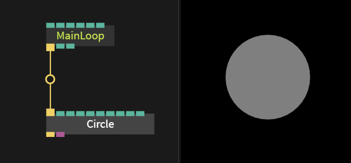

# Beginner 1: Drawing A Circle

First, we need a project to work with, so press the `New Project`-button.

To draw a circle, we need two operators:  

1. The WebGL-renderer
2. A circle-op

## 1.Add the WebGL-op

- To create an operator press `[esc]` – the `Select Operator`-dialog shows up
- Now enter `Main`
- The first entry in the list should be [Ops.Gl.MainLoop](../ops/Ops.Gl.MainLoop/Ops.Gl.MainLoop.md)
- Press `[enter]` to create the operator

## 2. Add The Circle Operator

- To create a new operator and automatically connect it to another op you can pull the blue output port on the left side with your mouse (drag it out of the operator and release your mouse button).

- The `Select Operator`-dialog is showing again
- Enter `circle`, now the entry [Ops.Gl.Meshes.Circle](../ops/Ops.Gl.Meshes.Circle/Ops.Gl.Meshes.Circle.md) should be selected
- Press `[enter]` to create it

Now it should look like this:  

## 3. Parameters

- The renderer canvas (on the right side) should show a circle now
- The parameter panel shows all parameters to tweak the circle
- Play around with the parameters, for example drag the slider `innerradius`

## Part 2

Continue to [Part 2](../beginner2_transformations/beginner2_transformations.md) of the tutorial-series to learn how to use transformations.
