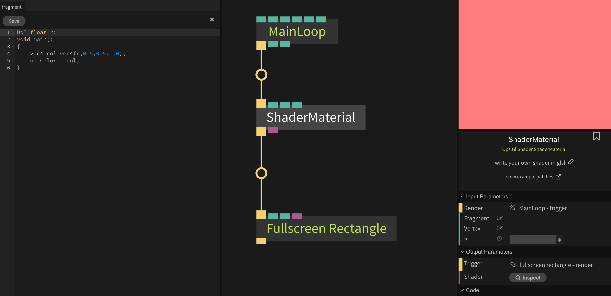
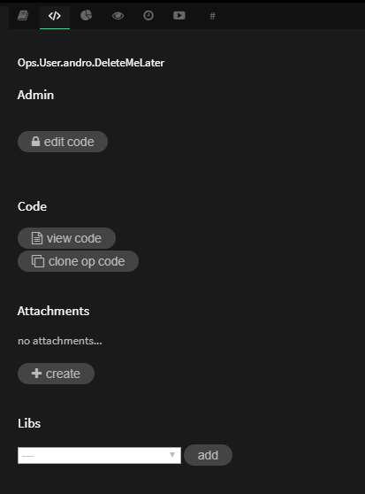

### Parameter Qualifiers

for better compatibility between webgl 1.x and 2.x, or GLSL v1 and v3 we use predefined qualifiers.

In GLSL >=3.0 you do not use qualifiers like `attribute` or `varying`, but `in` and `out`.

In cables we use `IN`, `OUT` and `UNI`, then your shader can be compiled for both GLSL versions used in webgl.


#### Vertex Shader Qualifiers

| GLSL 1.0    | GLSL 3.0  | cables |
| ----------- | --------- | ------ |
| `varying`   | `out`     | `OUT`  |
| `attribute` | `in`      | `IN`   |
| `uniform`   | `uniform` | `UNI`  |

#### Fragment Shader Qualifiers

| GLSL 1.0  | GLSL 3.0  | cables |
| --------- | --------- | ------ |
| `varying` | `in`      | `IN`   |
| `uniform` | `uniform` | `UNI`  |

------


### default cables inputs

#### vertex shader

```
vec3 vPosition;  	   - vertex position in object space
vec2 attrTexCoord; 	   - vertex texture coordinates
vec3 attrVertNormal;   - vertex normal

mat4 projMatrix;       - projection matrix
mat4 mvMatrix;         - modelview matrix
mat4 modelMatrix;      - model matrix
mat4 viewMatrix        - view matrix
mat4 inverseViewMatrix - inverted view matrix
```

#### fragment shader

```
IN vec2 texCoord;      - texture coordinate
IN vec3 norm;          - normal
```

------

### Ops.Gl.Shader.ShaderMaterial

`Ops.Gl.Shader.ShaderMaterial` can be used to live-edit shaders and see the results immediately. 
You can use shaderMaterial with any kind of mesh and the mesh will be drawn using your custom shader.



You can edit Fragment and Vertex Shader Code.

Uniforms are automatically added as Ports of the ShaderMaterial Op. (Currently `float` and `sampler2D`)

------


### Ops.Gl.Shader.ShowShader


You can always use `Ops.Gl.Shader.ShowShader` to view the source code of the current shader.
This is helpful if you combine multiple shaders via modules.

------


## Programming shader ops 

### Attachments

Attachments are files that can be created and read as a string in the op they are attached to.  

An attachment file can be created by clicking on an op and then clicking the create button

<br/>




<br/>

Fill in the name of your attachment file

<br/>


You can edit the attachment file by clicking on the edit button


This will open the editor allowing you to add your own script


The attachment can now be accessed inside of your op, select the op and press 'e' to enter edit mode.

 

<br/>


- binding ports to uniforms
- adding attributes?


### shader modules

