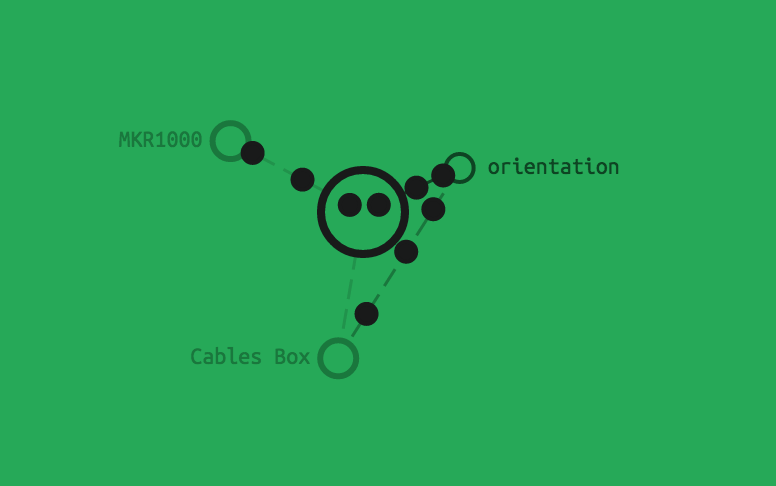

# MQTT

*Ops.Net.Mqtt.Mqtt*

[MQTT](http://mqtt.org/) (Message Queue Telemetry Transport)  is a lightweight messaging protocol which is widely used, e.g. by Facebook Messenger, for M2M (Machine to machine) communication. It used a publish-subscribe pattern to send messages from one device to another. Messages are send to so called channels (e.g. `/orientation/x/1.234`). Another device could then listen for this channel and get updates when data changes.  

For the communication to work an MQTT-broker (server) is needed, a very good service is [shiftr.io](https://shiftr.io) where users can create a free account which also features personal dashboards to show which data is sent around in realtime.  

The MQTT-ops currently allow to publish and subscribe data, QoS and topic-wildcards are not supported yet.

**Please note: ** User credentials can have read and write access to a data set or real-only. If you try to write out data using read-only user-credentials things will break!

## Input

### Client Name [String]

The name of your project / your name, can be freely set.

### Broker URL [String]

The URL of the MQTT-broker. We recommend using [shiftr.io](https://shiftr.io)

### Username [String]

Your username to access the MQTT broker, you need to set up a user-account for that or use the public namespace `try` / `try`.

### Password [String]

The password fitting to your username

### Port [Value]

The port the MQTT-server is running on. As cables runs in a HTTPS-environment only secure ports can be used to access a MQTT-broker (MQTTWSS). Only change this if you know what you are doing.

### Use SSL [Bool]

See [Port](#Port [Value]). Should be checked for most use-cases

### Reconnect [Function]

Executes a reconnect to the MQTT broker. If things don’t work out this might help. Otherwise a reload of the page can be a solution. If you enter new login-data (username / password) you also need to reconnect.

## Output

### MQTT Object

Contains MQTT-messages and general data, used for the communication between cables MQTT-ops. 

### Connected [Bool]

If the MQTT-op connected successfully. Please note that a connection can time-out, but it will still show as connected.